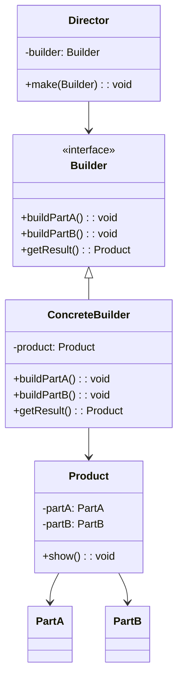
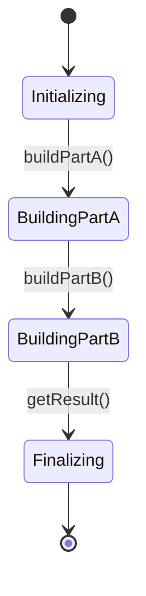
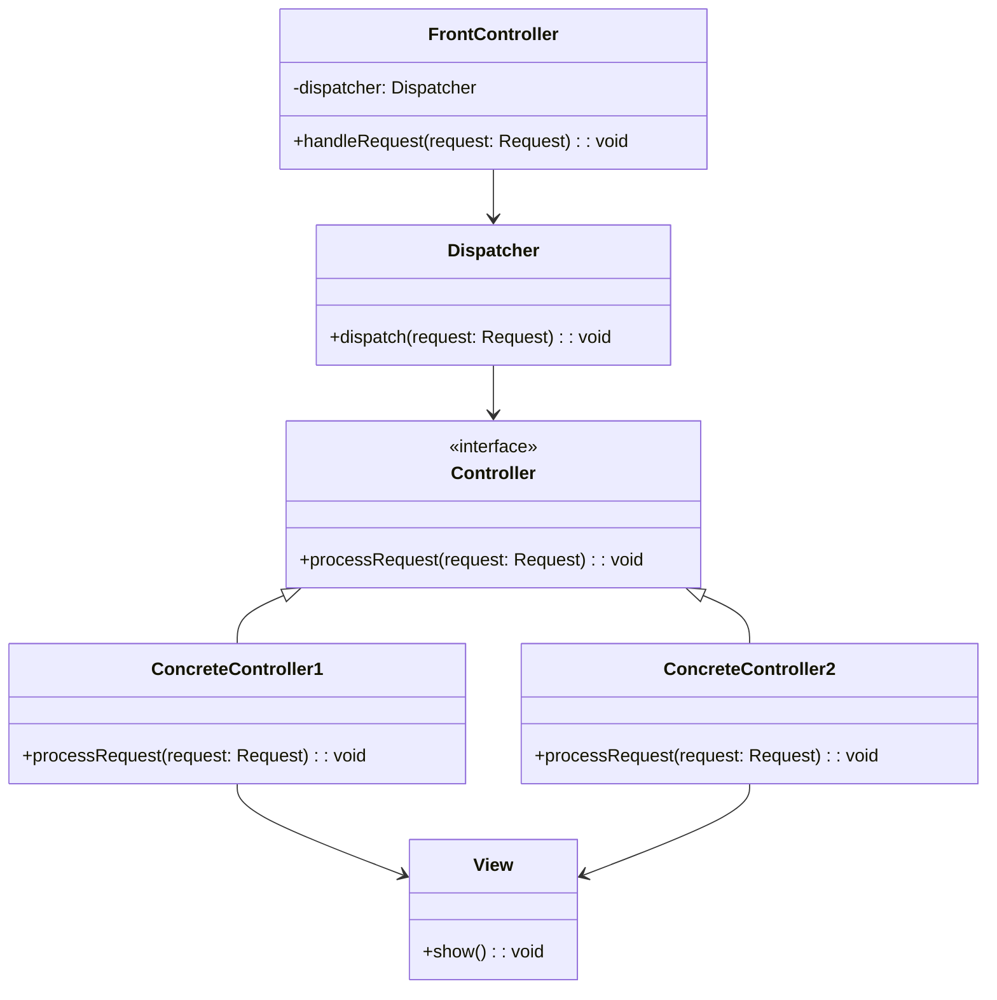
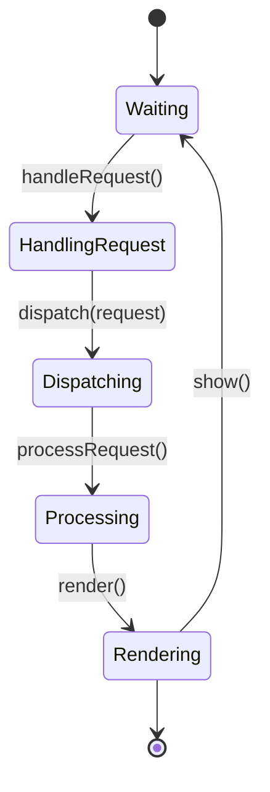
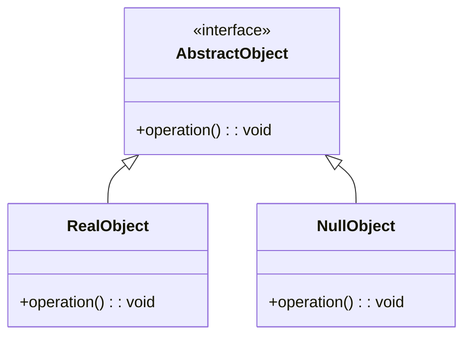
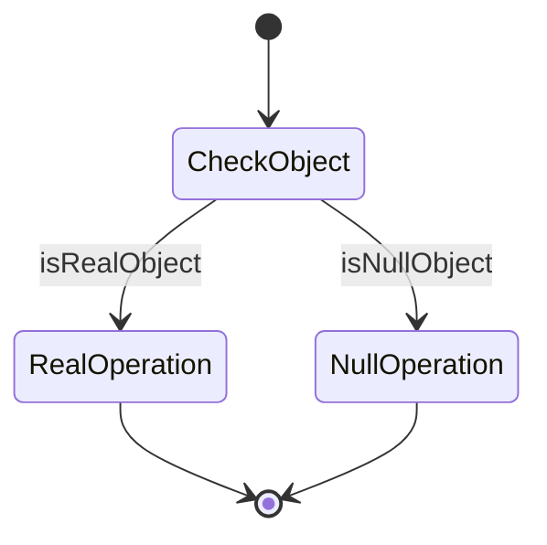

## Шаблон проектування Builder

Посилання: [https://refactoring.guru/uk/design-patterns/builder](https://refactoring.guru/uk/design-patterns/builder)
### Призначення та застосування шаблону

Шаблон проектування Builder (Будівельник) використовується для розділення процесу побудови складного об'єкта на окремі частини, що дозволяє поступово створювати цей об'єкт. Цей шаблон особливо корисний, коли необхідно створити різні представлення об'єкта або коли процес побудови об'єкта включає в себе багато кроків.

### Основні випадки застосування:

- Коли процес створення об'єкта складається з багатьох етапів або складних підзадач.
- Коли потрібні різні варіанти представлення об'єкта.
- Коли потрібно забезпечити контроль над процесом створення складного об'єкта.


### Опис основних структурних елементів
- Builder (Будівельник): Інтерфейс, який визначає методи для побудови різних частин об'єкта.
- ConcreteBuilder (Конкретний Будівельник): Клас, який реалізує інтерфейс Builder і забезпечує конкретну реалізацію методів побудови. Підтримує метод для отримання результату.
- Director (Директор): Клас, який керує побудовою об'єкта, використовуючи об'єкт Builder. Не є суворо обов’язковим, можна викликати методи будівельника безпосередньо з клієнтського коду.
- Product (Продукт): Клас, який представляє складний об'єкт, що будується. Містить частини, які були створені ConcreteBuilder.

### Псевдокод

```
Director director = new Director();
ConcreteBuilder concreteBuilder = new ConcreteBuilder();
director.make(concreteBuilder);
Product product = concreteBuilder.getResult();
```

### UML діаграма

Діаграма класів:



Діаграма стану:



## Шаблон проектування Front Controller

Посилання: https://www.baeldung.com/java-front-controller-pattern
### Призначення та застосування шаблону
Шаблон проектування Front Controller використовується для централізованого управління обробкою запитів в веб-застосунках. Він дозволяє всі запити користувачів проходити через один об'єкт контролера, який керує навігацією та обробкою запитів. Це допомагає спростити і уніфікувати обробку запитів, забезпечити контроль над доступом і виконанням спільних задач, таких як аутентифікація, логування або керування сесією.

### Основні випадки застосування:

- Коли необхідно централізовано керувати обробкою запитів.
- Коли потрібно виконувати загальні задачі (аутентифікація, логування тощо) для кожного запиту.
- Коли бажано зменшити дублювання коду у контролерах.


### Опис основних структурних елементів
- FrontController: Центральний об'єкт, який приймає всі запити, визначає відповідні дії для їх обробки та координує роботу з іншими компонентами.
- Dispatcher: Відповідає за перенаправлення запиту до відповідного контролера чи обробника.
- Controller: Абстракція або інтерфейс для різних конкретних контролерів, які обробляють різні типи запитів.
- View: Компонент, який відповідає за представлення даних користувачу.


### UML діаграма

Діаграма класів:



Діаграма стану:



## Шаблон проектування Null Object

Посилання: https://refactoring.guru/introduce-null-object

### Призначення та застосування шаблону
Шаблон проектування Null Object використовується для забезпечення поведінки "порожнього" об'єкта, який можна використовувати як замінник null-посилання. Він допомагає уникнути перевірок на null, спрощуючи код та підвищуючи його надійність.

### Основні випадки застосування:

- Коли потрібно уникнути численних перевірок на null.
- Коли потрібно надати дефолтну поведінку у випадках, коли об'єкт не наданий.
- Коли використання null може викликати помилки або ускладнити логіку програми.


### Опис основних структурних елементів
- AbstractObject (Абстрактний Об'єкт): Інтерфейс або абстрактний клас, що визначає загальні методи для всіх конкретних та нульових об'єктів.
- RealObject (Реальний Об'єкт): Клас, що реалізує AbstractObject і представляє собою реальну функціональність.
- NullObject (Нульовий Об'єкт): Клас, що реалізує AbstractObject і надає дефолтну, "порожню" поведінку.

### UML діаграма
Діаграма класів:

Діаграма стану:
