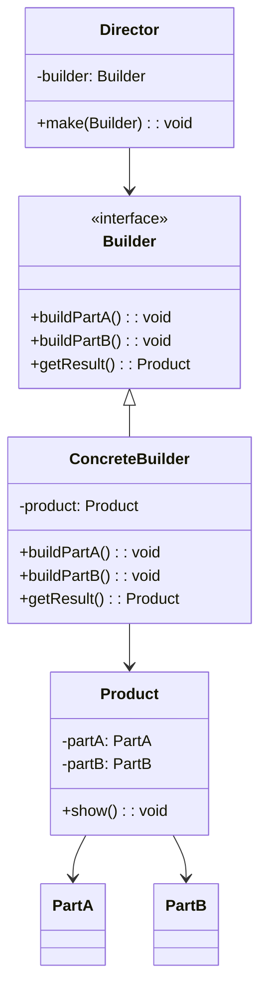
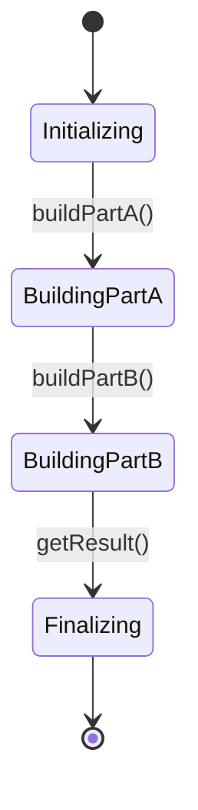

## Шаблон проектування Builder

Посилання: [https://refactoring.guru/uk/design-patterns/builder](https://refactoring.guru/uk/design-patterns/builder)
### Призначення та застосування шаблону

Шаблон проектування Builder (Будівельник) використовується для розділення процесу побудови складного об'єкта на окремі частини, що дозволяє поступово створювати цей об'єкт. Цей шаблон особливо корисний, коли необхідно створити різні представлення об'єкта або коли процес побудови об'єкта включає в себе багато кроків.

### Основні випадки застосування:

- Коли процес створення об'єкта складається з багатьох етапів або складних підзадач.
- Коли потрібні різні варіанти представлення об'єкта.
- Коли потрібно забезпечити контроль над процесом створення складного об'єкта.


### Опис основних структурних елементів
- Builder (Будівельник): Інтерфейс, який визначає методи для побудови різних частин об'єкта.
- ConcreteBuilder (Конкретний Будівельник): Клас, який реалізує інтерфейс Builder і забезпечує конкретну реалізацію методів побудови. Підтримує метод для отримання результату.
- Director (Директор): Клас, який керує побудовою об'єкта, використовуючи об'єкт Builder. Не є суворо обов’язковим, можна викликати методи будівельника безпосередньо з клієнтського коду.
- Product (Продукт): Клас, який представляє складний об'єкт, що будується. Містить частини, які були створені ConcreteBuilder.

### Псевдокод

```
Director director = new Director();
ConcreteBuilder concreteBuilder = new ConcreteBuilder();
director.make(concreteBuilder);
Product product = concreteBuilder.getResult();
```

### UML діаграма

Діаграма класів:



Діаграма стану:

